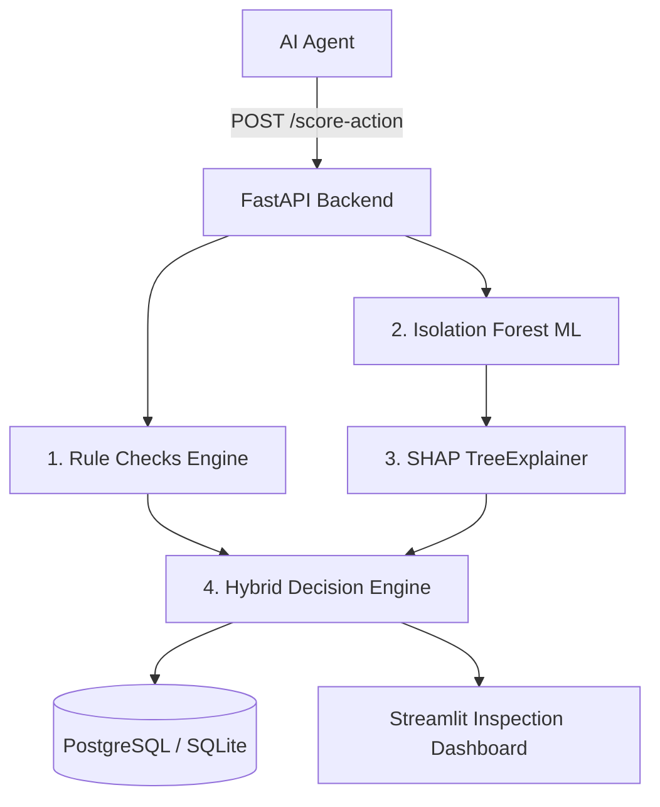

# 🛡️ Know Your Agent (KYA) — AI Agent Trust & Fraud Detection Layer

[](https://github.com/your-username/know-your-agent/actions)
[](https://fastapi.tiangolo.com)
[](https://streamlit.io)
[](https://scikit-learn.org)
[](https://github.com/shap/shap)

> **Hackathon Track**: AI Growth & Agentic Commerce  
> **Target Domain**: Autonomous AI Shopping & Payment Agents acting on behalf of users.

---

## 📌 Problem Statement

As autonomous AI agents (built on LLMs, LangChain, AutoGen, etc.) gain permission to make real-world transactions—such as booking orders, executing card payments, upgrading cloud subscriptions, and initiating API transfers—a critical security gap emerges:

1. **Prompt Injection & Agent Drift**: An agent can be hijacked or hallucinate, placing rogue orders or transferring funds to unverified payees.
2. **Velocity Attacks**: A rogue or looping agent can execute dozens of rapid transactions in seconds, draining user accounts before a human notices.
3. **Black-Box Uncertainty**: Traditional deep learning fraud models flag transactions without explaining *why*, leaving humans unable to verify whether an action was legitimate or fraudulent.

**"Know Your Agent" (KYA)** acts as an intermediate security and trust firewall between AI agents and financial settlement. It evaluates every proposed action in real time, applies hard safety boundaries + unsupervised Isolation Forest ML scoring, and provides **SHAP feature attributions** so humans can instantly understand and trust or override flagged decisions.

---

## 🏗️ Architecture Overview

```
                          ┌──────────────────────────┐
                          │  Autonomous AI Agent     │
                          │ (Shopping / Payment Bot) │
                          └─────────────┬────────────┘
                                        │ Proposed Action
                                        ▼
    ┌───────────────────────────────────────────────────────────────────────┐
    │                      KNOW YOUR AGENT (KYA) LAYER                      │
    │                                                                       │
    │  ┌───────────────────────┐             ┌───────────────────────────┐  │
    │  │ 1. Rule Engine        │             │ 2. Isolation Forest ML    │  │
    │  │ - Hard Amount Limit   │             │ - Unsupervised Anomaly    │  │
    │  │ - Velocity Window     │             │ - Multidimensional Vector │  │
    │  │ - New Merchant Check  │             │   (amount, hour, velocity)│  │
    │  │ - Off-Hours Timing    │             └─────────────┬─────────────┘  │
    │  └───────────┬───────────┘                           │                │
    │              │                                       ▼                │
    │              │                         ┌───────────────────────────┐  │
    │              │                         │ 3. SHAP Explainer         │  │
    │              │                         │ - Shapley Feature Values  │  │
    │              │                         │ - Plain-Text Attribution  │  │
    │              │                         └─────────────┬─────────────┘  │
    │              ▼                                       ▼                │
    │   ┌─────────────────────────────────────────────────────────────┐     │
    │   │                  4. Hybrid Decision Engine                  │     │
    │   │         Combines Rules + ML into Risk Score (0-100)         │     │
    │   └──────────────────────────────┬──────────────────────────────┘     │
    └──────────────────────────────────┼────────────────────────────────────┘
                                       │
                ┌──────────────────────┴──────────────────────┐
                │                                             │
                ▼                                             ▼
     [ Risk Score < 50 ]                             [ Risk Score >= 50 ]
    🟢 APPROVED / ALLOWED                          🔴 FLAGGED FOR HUMAN REVIEW
  (Settlement Proceeds)                            (Inspect SHAP Breakdown)
```



---

## 🧠 Why Hybrid Isolation Forest + Rules over Pure Deep Learning?

For core financial & agent trust applications, a **pure deep learning (e.g. Neural Network) approach was intentionally rejected** in favor of a **Hybrid Isolation Forest + Rule-Based system** for three critical reasons:

1. **Guaranteed Hard Safeguards**: An unsupervised or deep learning model alone might predict a $5,000 transaction to a new merchant is "90% normal" if similar amounts were seen in training. Explicit rule checks guarantee that hard spending limits (e.g., > $1,000) and velocity spikes immediately trigger risk flags without exception.
2. **Exact Feature Explainability (SHAP)**: Isolation Forests pair seamlessly with SHAP (`TreeExplainer`), computing exact mathematical Shapley values for each feature (`amount`, `velocity_5m`, `is_new_merchant`, `hour_of_day`). Neural networks produce non-linear black-box latent representations that are difficult to explain in human-auditable terms during real-time fraud review.
3. **No Requirement for Labeled Fraud Data**: In agentic commerce, fraud patterns evolve rapidly. Isolation Forest isolates anomalies by randomly partitioning features, detecting novel rogue agent behaviors without requiring millions of historical labeled fraud examples.

---

## 🚀 Quickstart & Setup Guide

### Option 1: Docker Compose (Recommended - Backend + Postgres + Streamlit)

```bash
# Clone the repository
git clone https://github.com/your-username/know-your-agent.git
cd know-your-agent

# Build and launch all services in containers
docker-compose up --build
```
- **FastAPI API**: `http://localhost:8000/docs`
- **Streamlit Dashboard**: `http://localhost:8501`

---

### Option 2: Local Standalone Development (SQLite Fallback)

```bash
# 1. Create Virtual Environment
python3 -m venv .venv
source .venv/bin/activate

# 2. Install Dependencies
pip install -r requirements.txt

# 3. Start FastAPI Server
uvicorn app.main:app --reload --port 8000

# 4. Open a new terminal tab and start Streamlit Dashboard
source .venv/bin/activate
streamlit run dashboard/streamlit_app.py --server.port=8501
```

---

## ⚡ Agent Action Simulator

To test the system against realistic agent traffic and injected anomalies:

```bash
# Run simulator posting 35 agent actions with 25% injected anomalies
python simulator/run_simulation.py --count 35 --anomaly-rate 0.25 --api-url http://localhost:8000
```

### Injected Anomaly Types:
- `UNUSUAL_AMOUNT`: Spikes transaction amount to 10x-20x user average ($1,200 - $7,500).
- `RAPID_BURST`: Triggers 6+ consecutive actions in under 60 seconds (high velocity spike).
- `UNVERIFIED_MERCHANT`: Directs high-value payments to unverified payees (`CryptoExchange-Anonymous`, `OffshorePayee`).
- `ODD_TIMING`: Submits checkout actions at 3:00 AM UTC off-hours.

---

## 📡 API Reference Documentation

### `POST /score-action`
Evaluates a proposed agent action, calculates risk score, and computes SHAP feature attributions.

**Request Body:**
```json
{
  "agent_id": "agent_shopping_bot_01",
  "user_id": "usr_alex_789",
  "action_type": "payment",
  "amount": 1450.00,
  "currency": "USD",
  "merchant_name": "Unverified-P2P-Transfer",
  "is_new_merchant": true,
  "ip_address": "192.168.1.50"
}
```

**Response (201 Created):**
```json
{
  "action": {
    "id": "c9a4b12e-4567-89ab-cdef-0123456789ab",
    "agent_id": "agent_shopping_bot_01",
    "amount": 1450.0,
    "merchant_name": "Unverified-P2P-Transfer"
  },
  "risk_score": {
    "risk_score": 78.5,
    "flagged": true,
    "risk_level": "HIGH",
    "rule_flags": [
      {
        "rule_name": "HARD_AMOUNT_EXCEEDED",
        "severity": "HIGH",
        "points": 45.0,
        "description": "Transaction amount ($1450.00) exceeds configured limit ($1000.00)"
      }
    ],
    "shap_explanation": {
      "summary_reasons": [
        "Transaction amount ($1450.00) exceeds configured limit ($1000.00) (+45 pts)",
        "Unusual amount ($1450.00) added +32.1 to risk score",
        "First-time/unverified merchant added +18.5 to risk score"
      ]
    }
  },
  "recommendation": "FLAG_FOR_HUMAN_REVIEW",
  "decision_reason": "Risk Score: 78.5/100 (HIGH). Transaction amount ($1450.00) exceeds configured limit ($1000.00) (+45 pts)"
}
```

### Additional Endpoints:
- `GET /actions?limit=50&flagged_only=true` — Get recent actions with risk details.
- `GET /audit/{action_id}` — Get full audit log and SHAP breakdown for a specific action.
- `GET /stats` — Aggregated metrics (total actions, flagged rate, average score).
- `GET /health` — Service health status.

---

## 🧪 Running PyTest Test Suite

```bash
# Run unit and integration tests
pytest -v
```

Tests cover:
- Rule engine velocity and amount limits (`tests/test_rules.py`)
- Isolation Forest fitting and anomaly prediction (`tests/test_ml_model.py`)
- SHAP feature attributions and output formatting (`tests/test_shap.py`)
- FastAPI endpoints and database transactions (`tests/test_api.py`)
- Action simulation and anomaly injection (`tests/test_simulator.py`)

---

## 🔮 What I'd Improve with More Time

1. **Human-in-the-Loop Override Webhooks**: Add an interactive webhook endpoint (`POST /override/{action_id}`) so human reviewers can approve/deny flagged actions directly from Slack or email notifications.
2. **Agent Behavioral Fingerprinting**: Track per-agent baseline distributions over time using online learning (e.g. streaming feature stores) rather than static user global averages.
3. **Cryptographic Action Attestation**: Sign approved agent actions with asymmetric keys (e.g. Ed25519) so financial gateways can verify the KYA risk engine approved the payload before executing settlement.
